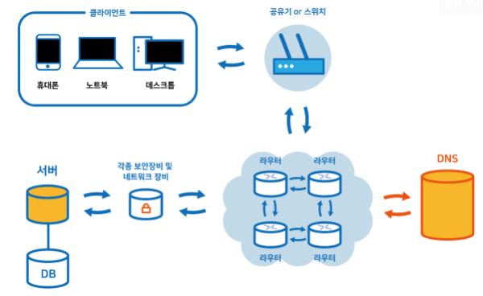
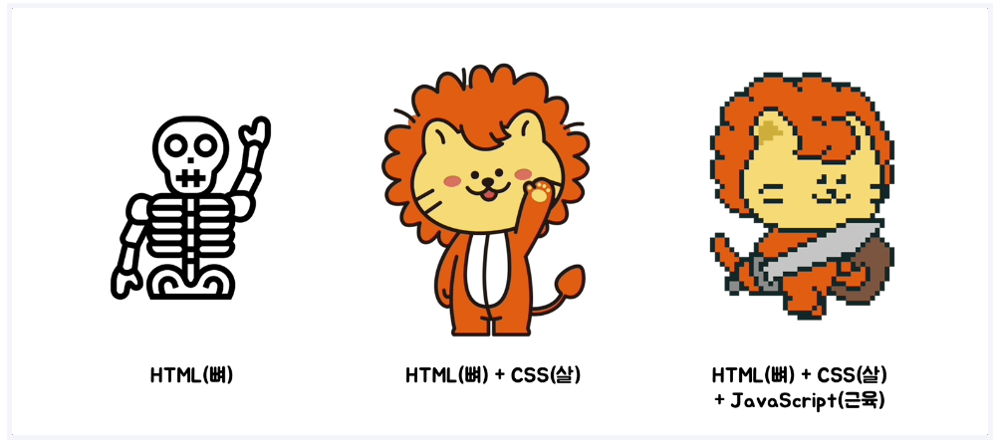

# 1. Time-sharing(시분할 시스템)

- 컴퓨터를 여러 사용자들이 시간적으로 분할하여 사용할 수 있도록 하는 시스템
- ex) 사람 1이 명령어를 입력하는 동안 CPU가 쉬는게 아닌, 사람 2가 이미 입력한 명령어를 처리해두는 방법

# 2. 인터넷

- 네트워크와 네트워크가 연결된 초 거대 네트워크
- inter: ~와 ~사이, net: 네트워크

# 3. 웹

- 서로 다른 운영체제, 파일 포맷, 하드웨어 구성 등의 난관을 극복할 수 있는, 정보를 공유하는 단일한 시스템
- 인터넷을 통해 정보를 공유하고 다양한 서비스를 이용할 수 있게 해주는 서비스
- ‘웹 페이지’라고 불리는 문서들의 모음이며 이 웹 페이지는 ‘하이퍼텍스트’를 이용하여 연결
- 최초의 웹사이트: http://info.cern.ch/

- 웹의 핵심 3요소 및 기타 중요 구성 요소
    - **html** (Hyper Text Markup Language): 웹 페이지의 구조와 내용을 정의
    - **http** (Hyper Text Transfer Protocol): 웹 브라우저와 웹 서버 간의 통신 규약(통신 약속)
    - **url** (Uniform Resource Locator): 웹 상의 자원 위치를 나타내는 주소
    - **DNS**(Domain Name System): 도메인 이름을 IP 주소로 변환하는 시스템
    - **웹 서버**: 클라이언트의 요청을 받아 처리하고 응답을 반환하는 서버
    - **웹 브라우저**: 사용자가 웹 페이지를 요청하고 받은 응답을 해석하여 보여주는 프로그램
    
    - 2024-05-03 추가 내용
        - IP: 도메인을 컴퓨터가 읽을 수 있게 만든 주소
        - URL: 제공하는 리소스의 이름인데 보통 IP와 매핑
        - PORT: 운영체제에서 관리하는 프로세스에 접근할 수 있게 하는 통로
        - fragment
            - 요청되는 url에 바로 접근할 수 있게 하는 id
            - 패이지 내의 특정 리소스에 바로 접근
            - weniv.co.kr/#hello
        - query
            - key1=value&key2=value2
            - [https://www.studyin.co.kr/search?keyword=파이썬](https://www.studyin.co.kr/search?keyword=%ED%8C%8C%EC%9D%B4%EC%8D%AC)
    
- 웹 페이지의 중요 구성 요소
    - HTML(Hypertext Markup Language): 웹 페이지의 구조와 내용을 정의
    - CSS(Cascading Style Sheets): 웹 페이지의 디자인과 레이아웃을 정의
    - JavaScript: 웹 페이지의 동적인 기능을 구현

- 웹의 동작
    
    
    

# 4. IT 분야의 직업군

- 프론트엔드
    - 웹 개발에서 사용자와 직접 상호작용하는 부분을 담당
    - HTML, CSS, JavaScript 등의 기술을 사용하여 **웹 페이지의 구조, 디자인, 동작을 구현**

- 백엔드
    - 웹 애플리케이션의 서버 측 로직과 데이터 처리를 담당하는 영역
    - 다양한 프로그래밍 언어와 프레임워크를 사용하여 웹 애플리케이션의 핵심 기능을 구현
    - 데이터베이스와 상호작용하며, **클라이언트의 요청에 응답**
    - Java(Spring, Spring-boot) / Node(Express, NestJS) / Python(fastAPI, Django)

- 기타
    - 정보 보호 전문가
    - 네트워크 엔지니어
    - 데이터베이스 관리자

# 5. 웹 상에서 프로그래밍 언어 역할

- HTML
    - HyperText Markup Language
        - **HyperText**(하이퍼텍스트): 정해진 순서 없이, ‘참조’를 통해 한 문서에서 다른 문서로 이동할 수 있는 텍스트
        - **Markup Language**(마크업 언어): 태그 등을 이용하여 문서나 데이터의 구조를 표시하는 언어
    - HTML은 프로그래밍 언어가 아닌 콘텐츠의 구조를 정의하는 마크업 언어
    - 웹을 이루는 가장 기초적인 구성 요소로, **웹 콘텐츠의 의미와 구조를 정의**
    - 확장자 .html

- CSS
    - Cascading Style Sheets
    - **웹 페이지의 모양/표현**
    - 확장자 .css

- JavaScript
    - **웹 페이지의 기능/동작**
    - 확장자 .js

- Python
    - **웹 페이지의 데이터 처리 담당**
    - 눈에 보이지는 않지만 핵심 기능을 수행하고 처리하는 중요한 역할을 수행
    - 데이터 처리 및 수행: 두뇌, 심장, 폐, 간
    - 보안: 면역계
    - 확장자 .py

※ 참고 자료
- https://paullabworkspace.notion.site/9d9928b3da424988be9dfe90cd26d5b8

- https://www.books.weniv.co.kr/basecamp-network/chapter02/02-1